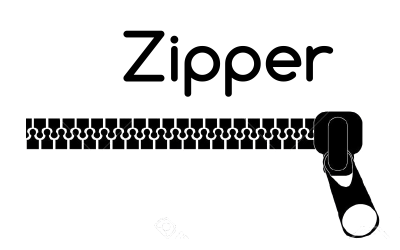

[Zipper](https://github.com/lecrapouille/zipper) is a C++20 wrapper around the minizip compression library. Its goal is to bring the power and simplicity of minizip to a more object-oriented and C++ user-friendly library.

This project is a continuation of the original [project](https://github.com/sebastiandev/zipper). The original project was created out of the need for a compression library that would be reliable, simple, and flexible. By flexibility, we mean supporting various types of inputs and outputs, specifically the ability to compress into memory instead of being restricted to file compression only, and using data from memory instead of just files.

This current fork repository was created because the original project was no longer maintained by its authors, and I, Lecrapouille, encountered issues due to missing administrative rights (needed for CI, branch management, API breaking changes, etc.).

## Zipper Features

- [x] Create zip files in memory.
- [x] Support for files, vectors, and generic streams as input for zipping.
- [x] In-memory zipping writes directly into the referenced `std::vector` /
      `std::iostream` as entries are added (no internal buffer copied only at
      `close()`). See `flush()` and `setAutoFlush()`.
- [x] File mappings for replacement strategies (overwrite if exists or use alternative names from mapping).
- [x] Password-protected zip (AES).
- [x] Preserve Unix file permissions (stored in the ZIP `external_fa` field) and
      strip `setuid`/`setgid` bits on extraction for safety.
- [x] Multi-platform support, including Unicode file paths (`std::filesystem::path`, UTF-8 `std::string`, `std::wstring` on Windows).
- [x] Project compiles as both static and dynamic libraries.
- [x] Protection flags against overwriting existing files during extraction.
- [x] Protection against the [Zip Slip attack](https://security.snyk.io/research/zip-slip-vulnerability), including through `alternative_names` remapping.
- [x] API to detect [Zip Bomb attacks](https://www.bamsoftware.com/hacks/zipbomb/). Extraction is not recursive.
- [x] Non-regression tests.

**:warning: Security Notice**

- Zipper currently vendors an old version of [minizip](https://github.com/Lecrapouille/minizip) (the classic nmoinvaz/minizip API, version 1.2.0 from 2017, pinned as `Lecrapouille/minizip@v1.2`) with some custom modifications. It is not minizip-ng. Keep this in mind for your own threat model.

## Getting Started

There are two ways to compile the project:

- Makefile: This is the official compilation method but only supports Linux and macOS
- CMake: Recently added, it supports all operating systems and was primarily added for Windows support

### Compiling / Installing with Makefile (Linux, MacOs, not working for Windows)

This is the official way to download the project and compile it:

```shell
git clone https://github.com/lecrapouille/zipper.git --recursive
cd zipper
make download-external-libs
make compile-external-libs
make -j8
```

Explanations of compilation commands:

- Git cloning requires the recursive option to install the Makefile helper and third-party libs (`zlib` and `minizip`) in the `external` folder. They are based on fixed SHA1. They are installed in the folder `external`.
- Optionally `make download-external-libs` will git clone HEADs of third-party libs (`zlib` and `minizip`) in the `external` folder. It is optional since it was initially used instead of git submodule.
- `make compile-external-libs` will compile third-party libs (`zlib` and `minizip`) but not install them on your operating system. They are compiled as static libraries and merged into this library inside the `build` folder.
- `make` will compile this library against the third-party libs (`zlib` and `minizip`). A `build` folder is created with two demos inside. Note: `-j8` should be adapted to your number of CPU cores.

See the [README](doc/demos/README.md) file for using the demos. To run demos, you can run them:

```shell
cd build
./unzipper-demo -h
./zipper-demo -h
```

To install C++ header files, shared and static libraries on your operating system, type:

```shell
sudo make install
```

You will see a message like:

```shell
*** Installing: doc => /usr/share/Zipper/4.0.0/doc
*** Installing: libs => /usr/lib
*** Installing: pkg-config => /usr/lib/pkgconfig
*** Installing: headers => /usr/include/Zipper-4.0.0
*** Installing: Zipper => /usr/include/Zipper-4.0.0
```

For developers, you can run non regression tests. They depend on:

- [googletest](https://github.com/google/googletest) framework
- lcov for code coverage

```shell
make tests -j8
```

### Compiling / Installing with CMake (Linux, MacOs, Windows)

As an alternative, you can also build the project using CMake:

```shell
git clone https://github.com/lecrapouille/zipper.git --recursive
cd zipper
mkdir build
cd build
cmake .. -DZIPPER_SHARED_LIB=ON -DZIPPER_BUILD_DEMOS=ON -DZIPPER_BUILD_TESTS=ON
# Either:
cmake --build . --config Release
# Or: make -j8
```

Optional options:

- `-DZIPPER_SHARED_LIB=ON` allows creating a shared lib instead of static lib.
- `-DZIPPER_BUILD_DEMOS=ON` allows compiling zipper and unzipper "hello world" demos.
- `-DZIPPER_BUILD_TESTS=ON` allows compiling unit tests (if you are a developer).

### Linking Zipper to your project

- In your project, add the needed headers in your C++ files:

```c++
#include <Zipper/Unzipper.hpp>
#include <Zipper/Zipper.hpp>
```

- To compile your project "as it" against Zipper, the simplest way is to use the `pkg-config` command:

```shell
g++ -W -Wall --std=c++20 main.cpp -o prog `pkg-config zipper --cflags --libs`
```

- For Makefile:
  - set `LDFLAGS` to `pkg-config zipper --libs`
  - set `CPPFLAGS` to `pkg-config zipper --cflags`

- For CMake:

```cmake
find_package(zipper REQUIRED)
target_link_libraries(your_application zipper::zipper)
```

You have an example [doc/demos/CMakeHelloWorld](here).

## API

There are two classes available: `Zipper` and `Unzipper`. They behave in the same manner regarding constructors and storage parameters.

### Zipping API

#### Header

```c++
#include <Zipper/Zipper.hpp>
using namespace zipper;
```

#### Constructor

- Constructor without password and replace `ziptest.zip` if already present. The new zip archive is empty. The flag `Zipper::OpenFlags::Overwrite` is optional. `std::string` paths are UTF-8; `std::filesystem::path` and `std::wstring` are also accepted.

```c++
Zipper zipper("ziptest.zip", Zipper::OpenFlags::Overwrite);
Zipper zipper(std::filesystem::path(u8"données/archive.zip"));
```

- Constructor without password and preserve `ziptest.zip` if already present. The flag `Zipper::OpenFlags::Append` is mandatory!

```c++
Zipper zipper("ziptest.zip", Zipper::OpenFlags::Append);
```

- Constructor with password (using AES algorithm) and replace `ziptest.zip` if already present. The new zip archive is empty. The flag `Zipper::OpenFlags::Overwrite` is optional.

```c++
Zipper zipper("ziptest.zip", "my_password", Zipper::OpenFlags::Overwrite);
```

- Constructor with a password and preserve `ziptest.zip` if already present. The flag `Zipper::OpenFlags::Append` is mandatory!

```c++
Zipper zipper("ziptest.zip", "my_password", Zipper::OpenFlags::Append);
```

- Constructor for in-memory zip compression (storage inside std::iostream):

```c++
std::stringstream zipStream;
Zipper zipper(zipStream);
Zipper zipper(zipStream, Zipper::OpenFlags::Overwrite);
Zipper zipper(zipStream, Zipper::OpenFlags::Append);
Zipper zipper(zipStream, "my_password");
Zipper zipper(zipStream, "my_password", Zipper::OpenFlags::Overwrite);
Zipper zipper(zipStream, "my_password", Zipper::OpenFlags::Append);
```

- Constructor for in-memory zip compression (storage inside std::vector):

```c++
std::vector<unsigned char> zipVector;
Zipper zipper(zipVector);
Zipper zipper(zipVector, Zipper::OpenFlags::Overwrite);
Zipper zipper(zipVector, Zipper::OpenFlags::Append);
Zipper zipper(zipVector, "my_password");
Zipper zipper(zipVector, "my_password", Zipper::OpenFlags::Overwrite);
Zipper zipper(zipVector, "my_password", Zipper::OpenFlags::Append);
```

- Note: all constructors will throw a `std::runtime_error` exception in case of failure.

```c++
try
{
    Zipper zipper("ziptest.zip", ...);
    ...
}
catch (std::runtime_error const& e)
{
    std::cerr << e.what() << std::endl;
}
```

- If this is not a desired behavior, you can choose the alternative dummy constructor followed by the `open` method which takes the same arguments as constructors. This method does not throw but will return `false` in case of error, you can get the reason by calling `error()`.

```c++
// Dummy constructor
Zipper zipper;

// Same arguments than seen previously with constructors.
if (!zipper.open(...))
{
    std::cerr << zipper.error() << std::endl;
}
```

#### Closing / Reopening

Do not forget to call `close()` explicitly (it's called implicitly from the destructor) otherwise
the zip will not be well-formed and `Unzipper` (or any unzipper application) will fail to open it, for example.

```c++
Zipper zipper("ziptest.zip", ...);
...
zipper.close(); // Now Unzipper unzipper("ziptest.zip") can work
```

After `close()` you can reopen the zip archive with `open()` without arguments. You can pass the same arguments than seen previously with constructors to open with new password or flags. Note: that any open method will call implicitly the close() method.

```c++
Zipper zipper("ziptest.zip", ...);
...
zipper.close();
...

zipper.open();
...
zipper.close();
```

#### Live in-memory output, `flush()` and auto-flush

When zipping into a `std::vector` or a `std::iostream`, Zipper writes directly
into that reference as you call `add()`: there is no internal buffer that is
only copied back at `close()`. The referenced container therefore grows on each
`add()`.

However, a ZIP archive is only a **valid, parsable** file once its *central
directory* and *End Of Central Directory* record have been written, and those
are emitted only when the archive is finalized. So until you finalize, the
reference holds valid raw bytes but no directory index (an `Unzipper` cannot
open it yet).

- Call `close()` to finalize (the archive can no longer be appended to
  afterwards, unless you `open()`/`reopen()` again).
- Call `flush()` to finalize **and** immediately reopen for appending: the
  reference becomes a valid archive right now, and you can keep adding entries.

```c++
std::vector<unsigned char> zip_vector;
Zipper zipper(zip_vector);

std::ifstream input1("some file");
zipper.add(input1, "Test1");

zipper.flush(); // zip_vector is now a valid ZIP and the zipper stays open

Unzipper unzipper(zip_vector); // works, sees "Test1"
// ...

std::ifstream input2("another file");
zipper.add(input2, "Test2"); // keep appending
zipper.close();
```

- `setAutoFlush(true)` finalizes + reopens after **every** successful `add()`,
  so the reference is always a valid archive. This is opt-in because it rewrites
  the central directory on each `add()`, turning the insertion of N files into
  an O(n²) operation. Use it only when a consumer must observe every
  intermediate state.

```c++
std::vector<unsigned char> zip_vector;
Zipper zipper(zip_vector);
zipper.setAutoFlush(true);

zipper.add(input1, "Test1"); // zip_vector already a valid ZIP here
zipper.add(input2, "Test2"); // still valid after each add()
zipper.close();
```

#### Appending files or folders inside the archive

The `add()` method allows appending files or folders. The `Zipper::ZipFlags::Better` is set implicitly. Other options are (as the last argument):

- Store only: `Zipper::ZipFlags::Store`.
- Compress faster, less compressed: `Zipper::ZipFlags::Faster`.
- Compress intermediate time/compression: `Zipper::ZipFlags::Medium`.
- Compress better: `Zipper::ZipFlags::Better`.
- To preserve directory hierarchy add `| Zipper::ZipFlags::SaveHierarchy` else files are only stored.

In case of success, the `add()` will return `true`; otherwise it will return `false` and `error()` should be used for getting the std::error_code.

- Adding an entire folder to a zip:

```c++
Zipper zipper("ziptest.zip");
zipper.add("myFolder/");
zipper.close();
```

- Adding a file by name:

```c++
Zipper zipper("ziptest.zip");
zipper.add("myFolder/somefile.txt");
zipper.close();
```

- You can change their name in the archive:

```c++
Zipper zipper("ziptest.zip");
zipper.add("somefile.txt", "new_name_in_archive");
zipper.close();
```

- Create a zip file with 2 files referred by their `std::ifstream` and change their name in the archive:

```c++
std::ifstream input1("first_file");
std::ifstream input2("second_file");

Zipper zipper("ziptest.zip");
zipper.add(input1, "Test1");
zipper.add(input2, "Test2");
zipper.close();
```

Note that:

- `zipper::close()` (or `flush()`) writes the ZIP central directory and makes
  the in-memory archive well formed. When zipping to a `std::vector` /
  `std::iostream`, the entry bytes are already written into that reference as
  you `add()`, but the archive is only parsable after `close()`/`flush()`.
- do not read the output vector/stream as an archive before `close()`/`flush()`
  was called.
- be sure the input `std::ifstream` and the output vector/stream are not
  deleted before `close()` was called.

- Add a file with a specific timestamp:

```c++
std::ifstream input("somefile.txt");
std::tm timestamp;
timestamp.tm_year = 2024;
timestamp.tm_mon = 0;
timestamp.tm_mday = 1;
timestamp.tm_hour = 12;
timestamp.tm_min = 1;
timestamp.tm_sec = 2;

Zipper zipper("ziptest.zip");
zipper.add(input, timestamp, "somefile.txt");
zipper.close();
```

- Zipper has security against [Zip Slip vulnerability](https://security.snyk.io/research/zip-slip-vulnerability).

```c++
zipper.add(input1, "../Test1");
```

Will always return `false` because `Test1` would be extracted outside the destination folder. This prevents malicious attacks from replacing your system files:

```c++
zipper.add(malicious_passwd, "../../../../../../../../../../../../../../../etc/passwd");
```

Because in Unix, trying to go outside the root folder `/` will stay in the root folder. Example:

```bash
cd /
pwd
cd ../../../../../../../../../../../../../../..
pwd
```

- The Zipper lib forces canonical paths in the archive. The following code works (will return `true`):

```c++
zipper.add(input1, "foo/../Test1");
```

because `foo/../Test1` is replaced by `Test1` (even if the folder `foo` is not present in the
zip archive).

#### In-memory: Vector and stream

- Do not forget that `close()` (or `flush()`) finalizes the in-memory zip file:
  you cannot use `Unzipper` on the same memory until `Zipper::close()` (or
  `Zipper::flush()`) has been called (meaning: even if you have called
  `Zipper::add`, the archive is not well formed until then). See the
  [Live in-memory output, flush() and auto-flush](#live-in-memory-output-flush-and-auto-flush)
  section.
- Creating a zip file using the awesome streams from the [boost](https://www.boost.org/) library that lets us use a vector as a stream:

```c++
#include <boost/interprocess/streams/vectorstream.hpp>
...

boost::interprocess::basic_vectorstream<std::vector<char>> input_data(some_vector);

Zipper zipper("ziptest.zip");
zipper.add(input_data, "Test1");
zipper.close();
```

- Creating a zip in a vector with files:

```c++
#include <boost/interprocess/streams/vectorstream.hpp>
...

boost::interprocess::basic_vectorstream<std::vector<char>> zip_in_memory;
std::ifstream input1("some file");

Zipper zipper(zip_in_memory); // You can pass password
zipper.add(input1, "Test1");
zipper.close();

Unzipper unzipper(zip_in_memory);
unzipper.extract(...
```

Or:

```c++
#include <vector>

std::vector<unsigned char> zip_vector;
std::ifstream input1("some file");

Zipper zipper(zip_vector); // You can pass password
zipper.add(input1, "Test1");
zipper.close();
```

- Creating a zip in-memory stream with files:

```c++
// Example of using stringstream
std::stringstream zipStream;
std::stringstream inputStream("content to zip");

Zipper zipper(zipStream); // You can pass password
zipper.add(inputStream, "Test1");
zipper.close();

// Example of extracting
zipper::Unzipper unzipper(zipStream);
unzipper.extract(...
```

### Unzipping API

#### Header

```c++
#include <Zipper/Unzipper.hpp>
using namespace zipper;
```

#### Constructor

- Constructor without password and opening `ziptest.zip` (should already be present).

```c++
Unzipper unzipper("ziptest.zip");
...
unzipper.close();
```

- Constructor with a password and opening `ziptest.zip` (should already be present).

```c++
Unzipper unzipper("ziptest.zip", "my_password");
...
unzipper.close();
```

- Constructor for in-memory zip extraction (from std::iostream):

```c++
std::stringstream zipStream;
// Without password
Unzipper unzipper(zipStream);
// Or with password:
Unzipper unzipper(zipStream, "my_password");
```

- Constructor for in-memory zip extraction (from std::vector):

```c++
// Without password
std::vector<unsigned char> zipVector;
Unzipper unzipper(zipVector);
// Or with password:
Unzipper unzipper(zipVector, "my_password");
```

- Note: all constructors will throw a `std::runtime_error` exception in case of failure.

```c++
try
{
    Unzipper unzipper("ziptest.zip", ...);
    ...
}
catch (std::runtime_error const& e)
{
    std::cerr << e.what() << std::endl;
}
```

#### Getting the list of zip entries

```c++
Unzipper unzipper("zipfile.zip");
std::vector<ZipEntry> entries = unzipper.entries();
for (auto& it: unzipper.entries())
{
    std::cout << it.name << ": "
              << it.timestamp
              << std::endl;
}
unzipper.close();
```

#### Getting the total uncompressed size

```c++
Unzipper unzipper("zipfile.zip");
size_t total_size = unzipper.sizeOnDisk();
if (total_size > MAX_ALLOWED_SIZE) {
    // Prevent zip bomb attack
    std::cerr << "Zip file too large!" << std::endl;
    return;
}
unzipper.close();
```

#### Extracting all entries from the zip file

Two methods are available: `extractAll()` for the whole archive and `extract()` for
a single element in the archive. They return `true` in case of success
or `false` in case of failure. In case of failure, use `unzipper.error();`
to get the `std::error_code`.

If you are scared of [Zip bomb attack](https://www.bamsoftware.com/hacks/zipbomb/) you can
check the total uncompressed size of all entries in the zip archive by calling
`unzipper.sizeOnDisk()` before `unzipper.extractAll(...)`.

```c++
// 1 gigabyte
const size_t MAX_TOTAL_UNCOMPRESSED_BYTES (1 * 1024 * 1024 * 1024)

Unzipper unzipper("zipfile.zip");
if (unzipper.sizeOnDisk() <= MAX_TOTAL_UNCOMPRESSED_BYTES)
{
    unzipper.extractAll(Unzipper::OverwriteMode::Overwrite);
}
else
{
    std::cerr << "Zip bomb attack prevented" << std::endl;
}
```

- If you do not care about replacing existing files or folders:

```c++
Unzipper unzipper("zipfile.zip");
unzipper.extractAll(Unzipper::OverwriteMode::Overwrite);
unzipper.close();
```

- If you care about replacing existing files or folders. The method will fail (return `false`)
if a file would be replaced and the method `error()` will give you information.

```c++
Unzipper unzipper("zipfile.zip");
unzipper.extractAll(); // equivalent to unzipper.extractAll(Unzipper::OverwriteMode::DoNotOverwrite);
unzipper.close();
```

- Extracting all entries from the zip file to the desired destination:

```c++
Unzipper unzipper("zipfile.zip");
unzipper.extractAll("/the/destination/path");        // Fail if a file exists (DoNotOverwrite is implicit)
unzipper.extractAll("/the/destination/path", Unzipper::OverwriteMode::Overwrite);  // Replace existing files
unzipper.close();
```

- Extracting all entries from the zip file using alternative names for existing files on disk:

```c++
std::map<std::string, std::string> alternativeNames = { {"Test1", "alternative_name_test1"} };
Unzipper unzipper("zipfile.zip");
unzipper.extractAll(".", alternativeNames);
unzipper.close();
```

- Extracting a single entry from the zip file:

```c++
Unzipper unzipper("zipfile.zip");
unzipper.extract("entry name");
unzipper.close();
```

Returns `true` in case of success or `false` in case of failure.
In case of failure, use `unzipper.error();` to get the `std::error_code`.

- Extracting a single entry from the zip file to destination:

```c++
Unzipper unzipper("zipfile.zip");
unzipper.extract("entry name", "/the/destination/path"); // Fail if a file exists (DoNotOverwrite is implicit)
unzipper.extract("entry name", "/the/destination/path", Unzipper::OverwriteMode::Overwrite); // Replace existing file
unzipper.close();
```

Returns `true` in case of success or `false` in case of failure.
In case of failure, use `unzipper.error();` to get the `std::error_code`.

- Extracting a single entry from the zip file to memory (stream):

```c++
std::stringstream output;
Unzipper unzipper("zipfile.zip");
unzipper.extract("entry name", output);
unzipper.close();
```

- Extracting a single entry from the zip file to memory (vector):

```c++
std::vector<unsigned char> unzipped_entry;
Unzipper unzipper("zipfile.zip");
unzipper.extract("entry name", unzipped_entry);
unzipper.close();
```

Returns `true` in case of success or `false` in case of failure.
In case of failure, use `unzipper.error();` to get the `std::error_code`.

- Extracting from a vector:

```c++
std::vector<unsigned char> zip_vector; // Populated with Zipper zipper(zip_vect);

Unzipper unzipper(zip_vector);
unzipper.extract("Test1");
```

- Zipper has security against [Zip Slip vulnerability](https://security.snyk.io/research/zip-slip-vulnerability): if an entry has a path outside the extraction folder (like `../foo.txt`) it
will return `false` even if the replace option is set.

#### Progress Callback

You can monitor the extraction progress by setting a callback function. The callback provides information about:

- Current status (OK, KO, InProgress)
- Current file being extracted
- Number of bytes read
- Total bytes to extract
- Number of files extracted
- Total number of files

Example:

```c++
Unzipper unzipper("zipfile.zip");

// Set the progress callback
unzipper.setProgressCallback([](const Unzipper::Progress& progress) {
    switch (progress.status) {
        case Unzipper::Progress::Status::InProgress:
            std::cout << "Extracting: " << progress.current_file
                      << " (" << progress.files_extracted << "/"
                      << progress.total_files << " files) "
                      << (progress.bytes_read * 100 / progress.total_bytes)
                      << "%" << std::endl;
            break;
        case Unzipper::Progress::Status::OK:
            std::cout << "Extraction completed successfully" << std::endl;
            break;
        case Unzipper::Progress::Status::KO:
            std::cout << "Extraction failed" << std::endl;
            break;
    }
});

// Start extraction
unzipper.extractAll();
unzipper.close();
```

Same idea for Zipper.

## FAQ

- Q: I used a password when zipping with the Zipper lib, but now when I want to extract data with my operating system's zip tool, I get an error.
- A: By default, Zipper uses the AES encryption algorithm, which is not the default encryption method for zip files. Your operating system's zip tools may not support AES. You can extract it using the 7-Zip tool: `7za e your.zip`. If you want to use the default zip encryption (at your own risk since the password can be cracked), you can remove the AES option in the following files: [Make](Make) and [external/compile-external-libs.sh](external/compile-external-libs.sh) and recompile the Zipper project.

- Q: Why are there two classes: one for zipping and one for unzipping? Couldn't we have made a single class to handle both operations?
- A: AFAIK this is a constraint imposed by the minizip API: No simultaneous operations are allowed - you cannot read from and write to a ZIP archive at the same time.

- Q: How do I remove a file from the zip?
- A: To modify an existing archive:
  - You generally need to create a temporary copy.
  - Copy the unchanged files.
  - Add the new files.
  - Replace the original.
